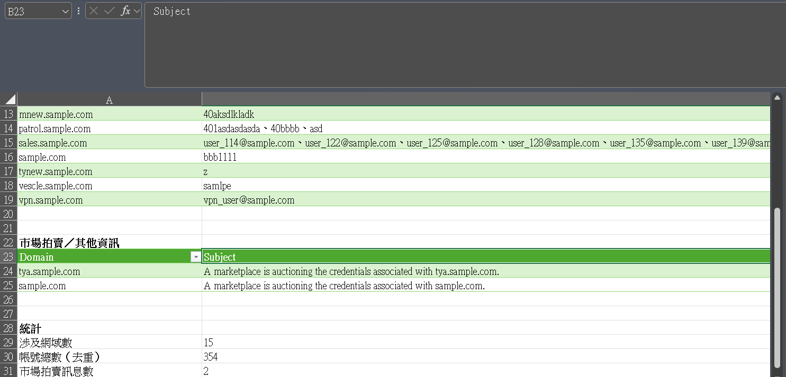

# CyCraft_EASM
A VBA automation tool for deduplicating, analyzing, and categorizing CyCraft EASM log data.
# CyCraft EASM Log Analyzer (VBA)

這是一個專門為 **CyCraft EASM (External Attack Surface Management)** 平台日誌設計的 Excel VBA 自動化工具。它能將匯出的 `.csv` 事件日誌轉換為結構化的分析報表，幫助資安人員快速掌握洩漏狀況。

## 🚀 主要功能

* **智慧去重 (Deduplication)**：支援依據「主旨」或「主旨 + 資產」(沒再用上，不維護)作為唯一識別碼，過濾海量日誌中的重複事件。
* **新增事件分析 (New This Week)**：自動比對指定區間，篩選出「歷史紀錄中首次出現」的全新洩漏事件。
* **自動化主旨解析**：
    * **帳號洩漏彙整**：使用正規表示法提取 `Credential of...` 中的帳號與網域，並依網域進行群組化彙整。
    * **拍賣訊息偵測**：識別 `marketplace is auctioning...` 事件並獨立列表，方便追蹤暗網拍賣情資。
* **格式自動美化**：產出報表時會自動套用邊框、凍結表頭、開啟自動篩選，並同步原始資料的欄寬。

## 🛠️ 使用說明

### 1. 檔案準備
1.  從 CyCraft 平台匯出 `.csv` 檔案 (2026/01/13: 一次只能一個月)。
2.  將舊有xlsx週報開啟 -> 資料 -> 從文字/CSV取得新下載資料。
3.  按下 `Alt + F11` 開啟 VBA 編輯器 -> `F7` 創建新的程式碼欄位，並貼入 `EASM_log_analyze.txt` 的程式碼。

### 2. 參數設定
根據你的檔案類型（Brand Risk 或 Security Posture），修改代碼頂端的欄位索引常量：

| 檔案類型 | COL_EVENT | COL_ASSET | COL_SUBJ | USE_COMPOSITE_SUBJECT_KEY |
| :--- | :---: | :---: | :---: | :---: |
| **Brand Risk** | 2 | 5 | 6 | False |
| **Security Posture** | 8 | 6 | 9 | True | (沒再用上，不維護)
 

### 3. 設定分析週期
請手動調整程式碼中的 `START` 與 `END` 年/月/日，以定義本週分析的時間範圍。

## 📂 產出報表結構

* **本周新增清單**：放置在第一個工作表，列出本週首次偵測到的高風險洩漏。

* **每週事件總覽**：提供期間統計數據，包括總數、上週出現數以及本週新增數。

* **事件明細(依主旨去重)**：完整的歷史資料去重清單，保留每項事件的最早紀錄。

* **主旨分類(依網域彙整)**：核心分析結果，將洩漏帳號依受影響網域分類並統計帳號數量。

---
**提示**：本工具使用 Windows 內建的 `Scripting.Dictionary` 進行高效處理，僅適用於 Windows 版 Excel。